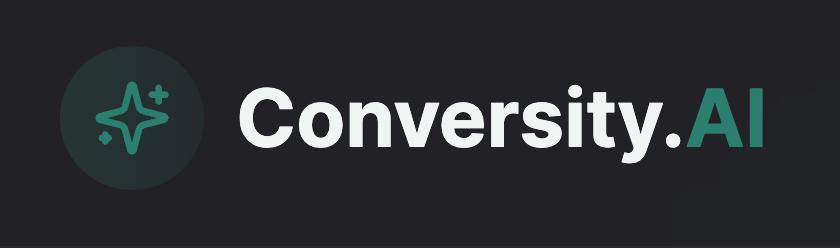

# Conversity.AI - RAG Agent Recommender API

<p align="center">
  
  <p align="center">
  The world has changed. Attention is shifting away from Google and social media towards AI interactions for thinking, deciding, searching, and BUYING. We're redefining advertising by connecting solutions to people at the ideal moment during their AI interactions.
  </p>
</p>

## 🤖 Core Technology

**RAG Agent System** built with:

- **LangChain** for LLM orchestration and prompt engineering
- **PGVector/Supabase** for vector similarity search and embeddings storage
- **Fastify** for high-performance API serving
- **OpenAI Embeddings** for semantic understanding
- **TypeScript** for type safety and developer experience

## 🎯 What It Does

This API powers an intelligent recommendation engine that:

1. **Analyzes user conversations** in real-time with AI agents
2. **Understands context and intent** using embeddings and LLMs
3. **Matches solutions to needs** through vector similarity search
4. **Provides personalized recommendations** at the perfect moment
5. **Learns from interactions** to improve over time

## ✅ System Status: Production Ready (95%)

### 🚀 Implemented Features
- ✅ **Solution Owners** - Company profiles with automatic embeddings
- ✅ **Solution Products** - Product catalog with semantic search
- ✅ **Chat System** - Conversational interface with thread history
- ✅ **User Onboarding** - Personalized context generation
- ✅ **RAG Recommendations** - AI-powered product matching
- ✅ **Auto Summaries** - Conversation analysis and context updates
- ✅ **Intent Classification** - Purchase intent detection
- ✅ **Similarity Search** - Vector-based product discovery
- ✅ **API Documentation** - Complete Swagger/OpenAPI specs

## 🚀 Quick Start

### 1. Install Dependencies
```bash
npm install
```

### 2. Environment Setup
```bash
cp env.example .env
```

Configure your `.env`:
```env
SUPABASE_URL=your_supabase_url
SUPABASE_ANON_KEY=your_supabase_anon_key  
SUPABASE_PROJECT_ID=your_project_id
OPENAI_API_KEY=your_openai_api_key
FIRECRAWL_API_KEY=your_firecrawl_api_key
PORT=3000
NODE_ENV=development
LOG_LEVEL=info
```

### 3. Database Setup

Set up your Supabase database with pgvector extension and create the required tables and functions.

### 4. Start the API

```bash
npm run dev
```

### 5. Access Documentation
- **API**: http://localhost:3000
- **Swagger Docs**: http://localhost:3000/docs
- **Health Check**: http://localhost:3000/health

## 🏗️ System Architecture

### RAG Agent Flow

```
User Message → Intent Analysis → Context Update → Embedding Generation → 
Similarity Search → Product Matching → LLM Response → Recommendations
```

### Core Components

```
src/
├── config/          # Database & environment configuration
├── types/           # TypeScript definitions & DTOs
├── services/        # Business logic & AI services
│   ├── chat.service.ts          # Conversation orchestration
│   ├── embeddings.service.ts    # Vector generation & similarity
│   ├── summary.service.ts       # LLM-powered summarization
│   └── recommendation.service.ts # RAG recommendation engine
├── repositories/    # Data access layer
├── routes/          # API endpoint definitions
├── lib/             # Utilities (OpenAI, prompts, crawling)
└── index.ts         # Fastify server
```

### Database Schema (PGVector)
- **solutions_owner**: Company profiles with embeddings
- **solutions_owner_products**: Product catalog with embeddings
- **users_enhanced_context**: User profiles with embeddings
- **users_chat_history**: Conversation threads
- **Custom SQL functions**: Vector similarity search functions

## 🧠 RAG Agent Intelligence

### 1. Context Understanding
- **User Profiling**: DISC personality analysis, preferences, needs
- **Conversation Analysis**: Intent classification, sentiment, topics
- **Thread Summarization**: Key points extraction, context preservation

### 2. Embedding Strategy
- **Text-to-Vector**: OpenAI text-embedding-3-small (1536 dimensions)
- **Weighted Combination**: 70% user context + 30% current thread
- **Similarity Search**: Cosine similarity with 0.7 threshold

### 3. Recommendation Engine
- **Vector Search**: PGVector IVFFLAT indexing for performance
- **Multi-signal**: User context, conversation history, intent score
- **Real-time**: Sub-200ms response times for recommendations

### 4. Continuous Learning
- **Context Updates**: Enhanced user profiles from conversations
- **Intent Tracking**: Purchase intent scoring (0-100)
- **Feedback Loop**: Recommendation relevance optimization

## 🚀 Production Deployment

### Environment Variables

```env
NODE_ENV=production
PORT=8080
LOG_LEVEL=warn
SUPABASE_URL=your_production_url
OPENAI_API_KEY=your_production_key
```

## 🎯 Use Cases

### 1. **SaaS Discovery**
User: "I need project management software"
→ RAG Agent analyzes context, finds matching SaaS solutions

### 2. **B2B Sales**
User: "Looking for enterprise security tools"
→ System matches user profile with relevant vendors

### 3. **Technology Consulting**
User: "Need AI implementation help"
→ Connects with appropriate AI consulting firms

### 4. **Product Recommendations**
User: "Want to automate customer support"
→ Recommends chatbot platforms, automation tools

---

**Powered by Conversity.AI** 🤖

*Redefining how solutions connect with people in the age of AI.*

For technical questions or contributions, visit our documentation at `/docs` or explore the interactive API at `/docs`. 
